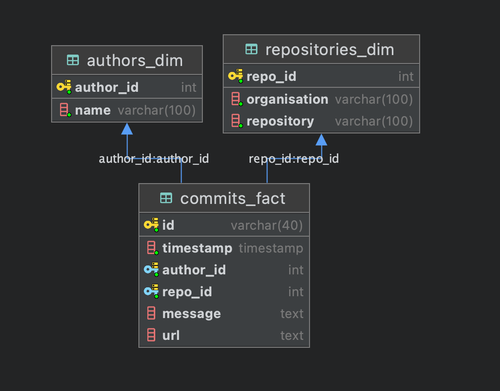
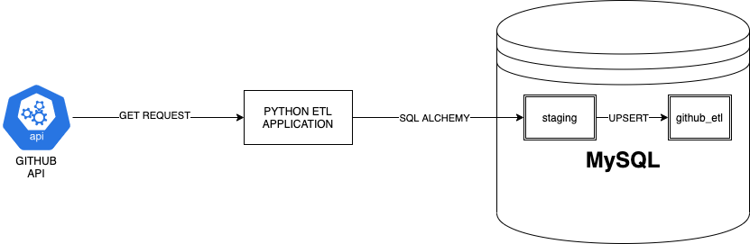

# ETL of Commits of a Github Repo

## Setup
1) Use poetry to create a virtual environment
```bash
poetry install
```
Alternatively use pip
```bash
pip install -r requirements.txt
```
### Third party libraries
1) **Requests**: To get data from Github API
2) **Pandas**: To use dataframes
3) **SQLAlchemy + PyMySQL**: To insert and query data from database
4) **Loguru**: For pretty and easy logging
5) **Tabulate**: For markdown representation of dataframe. Used to display heatmap.

## SQL Setup

Start up mysql service in docker container
```bash
docker-compose up
```
There exists some pre-existing data inside data/mysql which will be mounted onto the 
docker container.

### Scripts ran to create database & tables 
```mysql
create database github_etl;


create table repositories_dim
(
    repo_id      int          not null,
    organisation varchar(100) not null,
    repository   varchar(100) not null,
    constraint repositories_dim_repo_id_uindex
        unique (repo_id)
);

alter table repositories_dim
    add primary key (repo_id);


create table authors_dim
(
    author_id int          not null,
    name      varchar(100) not null,
    constraint authors_dim_author_id_uindex
        unique (author_id)
);

alter table authors_dim
    add primary key (author_id);


create table commits_fact
(
    id        int auto_increment,
    timestamp timestamp not null,
    date      date      not null,
    author_id int       not null,
    repo_id   int       not null,
    message   text      null,
    url       text      null,
    constraint commits_fact_id_uindex
        unique (id)
);

alter table commits_fact
    add primary key (id);


call staging.upsert_all();

        INSERT INTO commits_fact
        SELECT id, timestamp, author_id, repo_id, message, url FROM staging.commits_fact
        ON DUPLICATE KEY UPDATE id=staging.commits_fact.id;
create table STAGING.authors_dim
(
    author_id int          not null,
    name      varchar(100) not null,
    constraint authors_dim_author_id_uindex
        unique (author_id)
);

alter table staging.authors_dim
    add primary key (author_id);

create table staging.repositories_dim
(
    repo_id      int          not null,
    organisation varchar(100) not null,
    repository   varchar(100) not null,
    constraint repositories_dim_repo_id_uindex
        unique (repo_id)
);

alter table staging.repositories_dim
    add primary key (repo_id);

create table staging.commits_fact
(
    id        varchar(40) not null,
    timestamp timestamp   not null,
    author_id int         not null,
    repo_id   int         not null,
    message   text        null,
    url       text        null,
    constraint commits_fact_id_uindex
        unique (id),
    constraint commits_fact_authors_dim_author_id_fk
        foreign key (author_id) references authors_dim (author_id),
    constraint commits_fact_repositories_dim_repo_id_fk
        foreign key (repo_id) references repositories_dim (repo_id)
);

alter table staging.commits_fact
    add primary key (id);


create table STAGING.authors_dim
(
    author_id int          not null,
    name      varchar(100) not null,
    constraint authors_dim_author_id_uindex
        unique (author_id)
);

alter table staging.authors_dim
    add primary key (author_id);

create table staging.repositories_dim
(
    repo_id      int          not null,
    organisation varchar(100) not null,
    repository   varchar(100) not null,
    constraint repositories_dim_repo_id_uindex
        unique (repo_id)
);

alter table staging.repositories_dim
    add primary key (repo_id);

create table staging.commits_fact
(
    id        varchar(40) not null,
    timestamp timestamp   not null,
    author_id int         not null,
    repo_id   int         not null,
    message   text        null,
    url       text        null,
    constraint commits_fact_id_uindex
        unique (id),
    constraint commits_fact_authors_dim_author_id_fk
        foreign key (author_id) references authors_dim (author_id),
    constraint commits_fact_repositories_dim_repo_id_fk
        foreign key (repo_id) references repositories_dim (repo_id)
);

alter table staging.commits_fact
    add primary key (id);

call staging.upsert_all();

        INSERT INTO commits_fact
        SELECT id, timestamp, author_id, repo_id, message, url FROM staging.commits_fact
        ON DUPLICATE KEY UPDATE id=staging.commits_fact.id;
create table STAGING.authors_dim
(
    author_id int          not null,
    name      varchar(100) not null,
    constraint authors_dim_author_id_uindex
        unique (author_id)
);

alter table staging.authors_dim
    add primary key (author_id);

create table staging.repositories_dim
(
    repo_id      int          not null,
    organisation varchar(100) not null,
    repository   varchar(100) not null,
    constraint repositories_dim_repo_id_uindex
        unique (repo_id)
);

alter table staging.repositories_dim
    add primary key (repo_id);

create table staging.commits_fact
(
    id        varchar(40) not null,
    timestamp timestamp   not null,
    author_id int         not null,
    repo_id   int         not null,
    message   text        null,
    url       text        null,
    constraint commits_fact_id_uindex
        unique (id),
    constraint commits_fact_authors_dim_author_id_fk
        foreign key (author_id) references authors_dim (author_id),
    constraint commits_fact_repositories_dim_repo_id_fk
        foreign key (repo_id) references repositories_dim (repo_id)
);

alter table staging.commits_fact
    add primary key (id);


create procedure staging.upsert_all()
    BEGIN
        INSERT INTO github_etl.repositories_dim
        SELECT repo_id, organisation, repository FROM staging.repositories_dim
        ON DUPLICATE KEY UPDATE repo_id=staging.repositories_dim.repo_id;

        INSERT INTO github_etl.authors_dim
        SELECT author_id, name FROM staging.authors_dim
        ON DUPLICATE KEY UPDATE author_id=staging.authors_dim.author_id;

        INSERT INTO github_etl.commits_fact
        SELECT id, timestamp, author_id, repo_id, message, url FROM staging.commits_fact
        ON DUPLICATE KEY UPDATE id=staging.commits_fact.id;
    END;


```



## ETL Methodology


## Running application
If using poetry
```bash
poetry run python -m src.main
```
Without poetry
```bash
python -m src.main
```